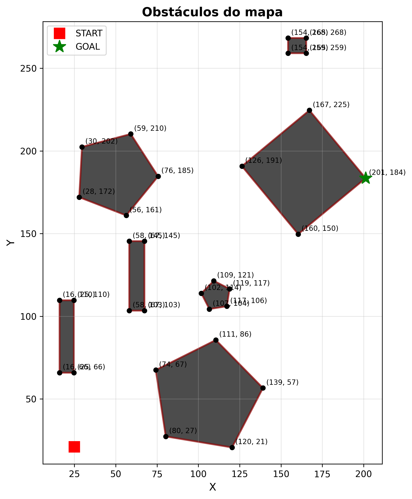
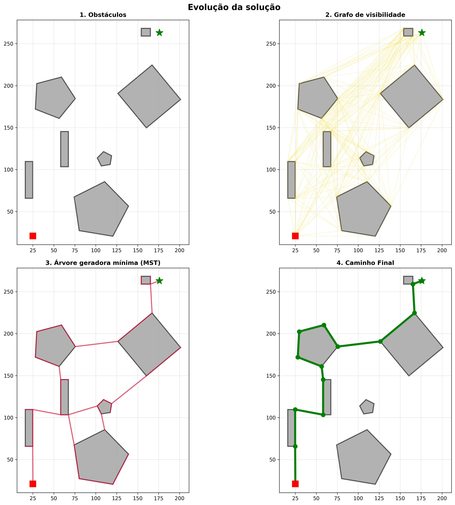

# Practice 2 - Graphs For Navigation

This project was devoloped by Otávio Joshua Costa Brandão Menezes and Larissa Ferreira Dias de Souza for the Graphs course. The objective is to apply graph theory concepts, such as visibility graphs and minimum spanning trees, to implement a robot navigation pipeline in a 2D enviroment with obstacles.

The solution implements a complete pipeline that:
- Reads a map file containing obstacles.
- Builds a Visibility Graph between all vertices (start/goal and obstacles corners).
- Calculates the Minimum Spanning Tree (MST) of this graph using Prim's Algorithm.
- Performs a Recursive Tree Search to find the lowest-cost path.
- Allows the user to set custom start and goal points, fiding the nearest vertices on the tree.
- Plots visualizations of all stages of the process.

## How to run
The project was developed in Python and requires a few external libraries.

**Prerequisites:**
- Python 3
- Libraries: `matplotlib` and `shapely`

**Installing dependencies:**

```bash
    pip install -r requirements.txt
```

**Running the program:**

```bash
    python main.py
```
This will open a interactive menu in the console:

```bash
─────────────────────────────────────────────────────────
  Graphs for Navigation in 2D maps
─────────────────────────────────────────────────────────
1 - Start
2 - Info
3 - Quit
─────────────────────────────────────────────────────────
```
- Mode 1: Uses the start (`q_start`) and goal (`q_goal`) points defined in the `Mapas/AquivoMapa.py` file.
- Mode 2: Allows the user to input new start and goal (x,y) coordinates trough the terminal.

At the ende of the execution, the program will display the plots using `matplotlib` and save threee images in the root directory:
- `mapa_obstaculos.png` (obstacles_map.png)
- `mapa_completo.png` (complete_map.png)
- `mapa_comparacao.png` (comparison_map.png)

## Project structure

```bash
GRAPHS-FOR-NAVIGATION
├── Algoritmos/
│   ├── minimum_generator_tree.py  #Prim's Algorithm implementation
│   ├── search_in_tree.py          #Depth-First Search implementation for the tree
│   └── VerticeMaisProximo.py      #"Nearest Vertex" function implementation
├── Mapas/
│   ├── Leitura.py                 #Classes (Vertex, Obstacle, Map) and reading function
│   ├── GrafoVisibilidade.py       #Visibility graph creation function
│   ├── Plotar.py                  #Plotting functions using matplotlib
│   └── ArquivoMapa.py             #Map data file (Step 1)
├── main.py                        #Entry point, menu, and orchestration
└── README.md                      #This file
```

## Implementation details
The project follows the steps defined in the practice description:

### Step 1: Map files
**Description:** The first step was to define a map file format and implement fuctions capable of reading it.

**Implementation:** The map is defined in `Mapas/AquivoMapa.py`. The format is a simple text file that defines the start point, goal point, the number of obstacles, and then, for each obstacle, the number of vertices (corners) and their coordinates. Comments (using # or ''') are ignored.

The file is read by the `read_file_map` fuction in `Mapas/Leitura.py`, which processes the file and instatiates the `Map`, `Obstacle` and `Vertex` classes.

**Format example (`ArquivoMapa.py`):**

```bash
'''
q_start_x, q_start_y
q_goal_x, q_goal_y
<number of obstacles>
<number of corners>
x_corner, y_corner
'''

25, 21          #x_start, y_start
176, 263        #x_goal, y_goal

7               #number of obstacles

4               #number of corners (first square)
24.75, 65.85    #x, y
15.95, 65.85    #x, y
...
```


### Step 2: Creating the Visibility Graph
**Description:** With the map read, the next step is to build the Visibility Graph. The nodes of this graph are all the vertices in the map (obstacle corners, q_start and q_goal points). An edge exists between two nodes if, and only if, a straight line between them does not intersect the interior of any obstacle.

**Implementation:** The `create_visibility_graph` fuction in Mapas/`GrafoVisibilidade.py` is responsible for this.

```bash
def create_visibility_graph(mapa: Map):
    #...
    vertexs = mapa.all_vertexs
    obstacles_polygon = [obs.get_polygon_shapely() for obs in mapa.obstacles]
    graph = {}
    
    #Iterate over all unique pairs of vertices
    for v1, v2 in itertools.combinations(vertexs, 2):
        current_line = LineString([v1.coords, v2.coords]) #Straight line (edge)
        has_obstacle = False
        
        for polygon in obstacles_polygon:
            #Shapely's magic: checks if the line crosses the interior
            if polygon and polygon.intersects(current_line) and not current_line.touches(polygon):
                has_obstacle = True
                break
            
        if not has_obstacle: #If no obstacle, add the edge to the graph
            cost = v1.distance(v2)
            #... (adds v1 and v2 to the adjacency list)
    return graph
```

The `shapely` library is used to create `Polygon` (obstacles) and `LineString` (edges). The `polygon.intersects(current_line)` check does the heavy lifting of collision detection. The edge is the Euclidean distance between the vertices.

**Visual result (from `mapa_comparacao.png`):** Panel 2 ("visibility graph") shows the result. It is a dense graph (in gold) that connects all points that can "see" each other.


### Step 3: Minimum Spanning Tree (Prim's Algorithm)
**Description:** The Visibility Graph is dense, to optimize the search, we calculate the Minimum Spanning Tree (MST), which is a subgraph that connects all vertices with the minimum possible total edge cost, without forming cycles. **Prim's Algorithm** was chosen for this task.

**Implemetation:** The `minimum_generator_tree` function (in `Algoritmos/minimum_generator_tree.py`) implements Prim's Algorithm.

```bash
def minimum_generator_tree(visibility_graph: dict, start_vertex: Vertex) -> dict:
    tree = {}
    visited = set()
    visited.add(start_vertex)

    while len(visited) < len(visibility_graph):
        min_edge = None
        for u in visited:   #For each vertex ALREADY IN THE TREE
            for v, cost in visibility_graph[u]: #For each neighbor of u
                if v not in visited:            #If neighbor v IS NOT YET in the tree
                    
                    #1. THE GREEDY STRATEGY HAPPENS HERE:
                    if min_edge is None or cost < min_edge[2]:
                        min_edge = (u, v, cost) #Save the smallest edge found so far

        if min_edge:
            u, v, cost = min_edge   
            tree.setdefault(u, []).append((v, cost)) #Add the edge to the tree
            tree.setdefault(v, []).append((u, cost)) 
            visited.add(v) #Mark the new vertex as visited

    return tree
```

**"Greedy" explanation:** The *greedy* nature of the algorithm is visible in Step 1. In each iteration, it inspects *all* edges that connect vertices from inside the tree (`visited`) to vertices outside. It then greedily chooses the edge with the lowest cos (`min_edge`) and adds it, guaranteeing that the final result is the global minimum cost tree.

**Visual result (from `mapa_comparacao.png`):** Panel 3 ("Minimum Spanning Tree") shows the MST (in crimson). Note how it forms a "skeleton" of the original graph, connecting all vvertices with far fewer edges.


### Step 4: `VerticeMaisProximo` Function
**Description:** This function is crucial for "Mode 2" (custom points). It takes an arbitrary (x,y) position on the map and finds the MST certex that is closest and has a direct line of sight (without crossing obstacles). 

**Implementation:** The `vertice_mais_proximo` function in `Algoritmos/VerticeMaisProximo.py` implements this logic.

```bash
def vertice_mais_proximo(posicao: tuple, arvore: dict, obstacles_polygons: list):
    #...
    min_distancia = float('inf')
    vertice_proximo = None
    
    for vertice in arvore.keys(): #Iterates through all vertices in the MST
        distancia = math.sqrt((vertice.x - posicao[0])**2 + (vertice.y - posicao[1])**2)
        
        if distancia < min_distancia:
            #Important: checks if the point can see the vertex
            if ponto_visivel(posicao, vertice, obstacles_polygons):
                min_distancia = distancia
                vertice_proximo = vertice
    #...
    return vertice_proximo
```
A helper function, `corrigir_ponto_invalido`, is also used to "push" points that the user might have palced inside an obstacle to the nearest border.

**Analysis:** This function serves as the "bridge" between an arbitrary user point and the navigation network (the MST). The final path will go from the user's point to this `vertice_proximo` and, from there, follow the tree.


### Step 5: Tree search algorithm
**Description:** With the MST and the start and end vertices (either from the file or from `verticeMaisProximo`), we need to find the path. Since the MST is a tree, there is only one unique path between any two nodes.

**Implementation:** A recursive Depth-First Search (DFS) was implemented in the `search_in_tree` function in `Algoritmos/search_in_tree.py`.

```bash
def search_in_tree(Tree: dict, start_node: Vertex, end_node: Vertex, path_dots, visited=None):
    if visited is None:
        visited = set()

    visited.add(start_node)
    path_dots.append(start_node) #Add the current node to the path

    if start_node == end_node: #Stopping condition: found the goal
        return 0

    for neighbor, cost in Tree.get(start_node, []):
        if neighbor not in visited:
            #Recursive call to explore the neighbor
            sub_path_cost = search_in_tree(Tree, neighbor, end_node, path_dots, visited)
            
            if sub_path_cost is not None: #If the recursion found the end
                return cost + sub_path_cost #Return the accumulated cost

    path_dots.pop() #Not found this way, remove from path
    return None
```

The function returns the total path cost and fills the `path_dots` list with the sequence of vertices that form the path.

**Visual result (from `mapa_comparacao.png`):** Panel 4 ("Final path") shows the result (in green). `main.py` takes the `path_dots` list and adds the user's actual start and end points to plot the complete path.


### Step 6: Plotting
**Description:** Plotting the path is an extra requirement that was implemented.

**Implementation:** The `Mapas/Plotar.py` file contains all the visualization code using `matplotlib`.
- `plotar_mapa_completo`: Generates the main visualization with all layers (obstacles, graph, tree and path).
- `plotar_comparacao`: Generates the 2x2 visualization that breaks down the process into the 4 panels shown below.

#### Operation examples
The program automatically saves the following images, which demonstrate the pipeline's operation (using the fixed points from ArquivoMapa.py).

1. Obstacles only (`mapa_obstaculos.png`):
initial map visualization, showing the obstacles (gray), the start (red square) and the goal (green star) points.



2. Complete visualization(`mapa_completo.png`):
Shows all layers superimposed.
- Obstacles (gray)
- Visibility Graph (gold, thin)
- MST (crimson, thicker)
- Final path (green, thickest, with markers)


3. Evolution comparison (`mapa_comparacao.png`):
This is the clearest visualization of the process, breaking the solution into 4 steps.
- Panel 1 (Obstacles): The raw problem.
- Panel 2 (Visibility Graph): All possible routes (without collision).
- Panel 3 (MST): The most efficient road network connecting all points.
- Panel 4 (Final path): The lowest-cost path found by the search (DFS) on the MST.




### Step 7: Organization (README)
**Description:** Is this file itself.
